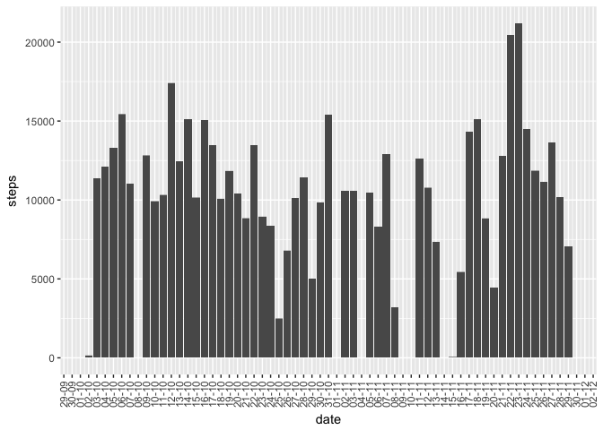
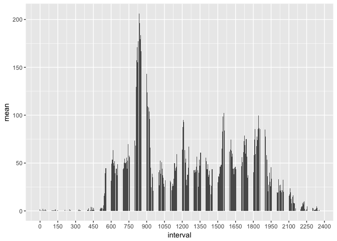
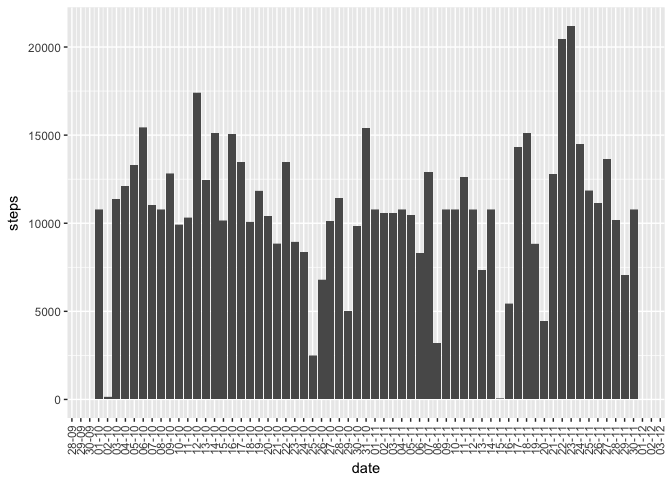
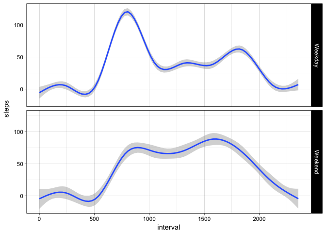

Load libraries to work
----------------------

    library("tidyr")
    library("dplyr")
    library("ggplot2")
    library("scales")
    library("lubridate")
    library("magrittr")

1 Loading and preprocessing the data
------------------------------------

    ## this function reads file and separate columns
    read_df <- function() {
            df1 <-tbl_df(read.csv2("activity.csv", na.strings = NA))
            names <- names(df1)
            names <- strsplit(names, split = "[.]")
            df1 <<- separate(df1, col = 1 ,sep = ",", into = names[[1]])        
    }

    read_df()
    ## this function changes classes of the columns
    change_classes <- function() {
            df1 %>% mutate(steps = as.numeric(steps)) %>%
            mutate(interval = as.numeric(interval)) %>%
            mutate(date = as.POSIXct(date, format = "%Y-%m-%d")) ->> df1 
    }

    change_classes()

2 What is mean total number of steps taken per day?
---------------------------------------------------

### 2.1 - 2.2 Calculate the total number of steps taken per day

    df1 %>%
            ggplot(aes(x = date,y =  steps)) + geom_bar(stat = "identity") +
            scale_x_datetime(date_breaks = "1 day", date_label = "%d-%m") +
            theme(axis.text.x = element_text(angle = 90, vjust = 0.5))

### 2.3 Calculate and report the mean and median of the total number of steps taken per day

    df1 %>%
            summarise(mean = mean(steps,na.rm = TRUE), median = median(steps, TRUE))

    ## # A tibble: 1 x 2
    ##    mean median
    ##   <dbl>  <dbl>
    ## 1  37.4      0

3 What is the average daily activity pattern?
---------------------------------------------

### 3.1 Make a time series plot (i.e. type = "l") of the 5-minute interval (x-axis) and the average number of steps taken, averaged across all days (y-axis)

    df1 %>%
            group_by(interval) %>%
            summarise(mean = mean(steps, na.rm = TRUE))  %>%
            ggplot(aes(x = interval, y = mean)) + geom_bar(stat = "identity")+
            scale_x_continuous(breaks = seq(0, 2500, by = 150))

### 3.2 Which 5-minute interval, on average across all the days in the dataset, contains the maximum number of steps?

    df1 %>%
            group_by(interval) %>%
            summarise(mean = mean(steps, na.rm = TRUE)) %>%
            filter(mean ==  max(mean))

    ## # A tibble: 1 x 2
    ##   interval  mean
    ##      <dbl> <dbl>
    ## 1      835  206.

4 Imputing missing values
-------------------------

### 4.1 Calculate and report the total number of missing values in the dataset (i.e. the total number of rows with NAs)

    sum(!complete.cases(df1))

    ## [1] 2304

### 4.2 Devise a strategy for filling in all of the missing values in the dataset. The strategy does not need to be sophisticated. For example, you could use the mean/median for that day, or the mean for that 5-minute interval, etc.

    ##I will use inerval mean to fill it in missing values

### 4.3 Create a new dataset that is equal to the original dataset but with the missing data filled in.

Firstly we will make a new dataframe which contains data with mean steps
per each interval

    df1 %>%
            group_by(interval) %>%
            summarise(mean = mean(steps, na.rm = TRUE)) ->> df3

Secondly use loops to insert values

    df2 <- df1

    for (i in 1:length(df2$steps)) {
            if (is.na(df2$steps[i]) == TRUE) {
                    
                    df2$steps[i] <- df3$mean[match(df2$interval[i], df3$interval)]  
            }
    }

### 4.4 Make a histogram of the total number of steps taken each day and Calculate and report the mean and median total number of steps taken per day. Do these values differ from the estimates from the first part of the assignment? What is the impact of imputing missing data on the estimates of the total daily number of steps?

    df2 %>%
            ggplot(aes(x = date,y =  steps)) + geom_bar(stat = "identity") +
            scale_x_datetime(date_breaks = "1 day", date_label = "%d-%m") +
            theme(axis.text.x = element_text(angle = 90, vjust = 0.5))

    df2 %>%
            summarise(mean = mean(steps,na.rm = TRUE), median = median(steps, TRUE))

    ## # A tibble: 1 x 2
    ##    mean median
    ##   <dbl>  <dbl>
    ## 1  37.4      0

**Answer: No difference in mean df1(with NA) and mean df2(without NA).
No difference in median df1(with NA) and median df2(without NA). Added
some values to 5-6 intervals which makes no sense **

5 Are there differences in activity patterns between weekdays and weekends?
---------------------------------------------------------------------------

### 5.1 Create a new factor variable in the dataset with two levels – “weekday” and “weekend” indicating whether a given date is a weekday or weekend day.

    df2 <- mutate(df2, weekday = weekdays(df2$date)) 

            for (i in 1:length(df2$weekday)) {
                    if (df2$weekday[i] == "Saturday" || df2$weekday[i] == "Sunday" ) {
                            df2$day_type[i] <- "Weekend"
                    } else {
                            df2$day_type[i] <- "Weekday"
                    }
            } 

    df2$day_type <- as.factor(df2$day_type)

### 5.2 Make a panel plot containing a time series plot (i.e. type="l") of the 5-minute interval (x-axis) and the average number of steps taken, averaged across all weekday days or weekend days (y-axis). See the README file in the GitHub repository to see an example of what this plot should look like using simulated data.

    df2 %>% 
            ggplot(aes(x = interval, y = steps)) + geom_smooth() +
            theme_linedraw() + facet_grid(day_type ~ .)

